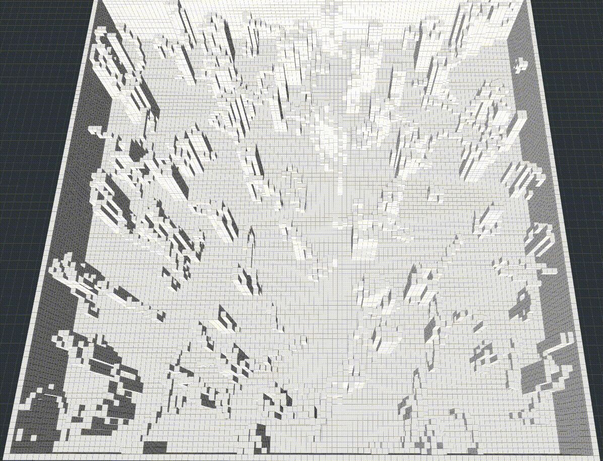
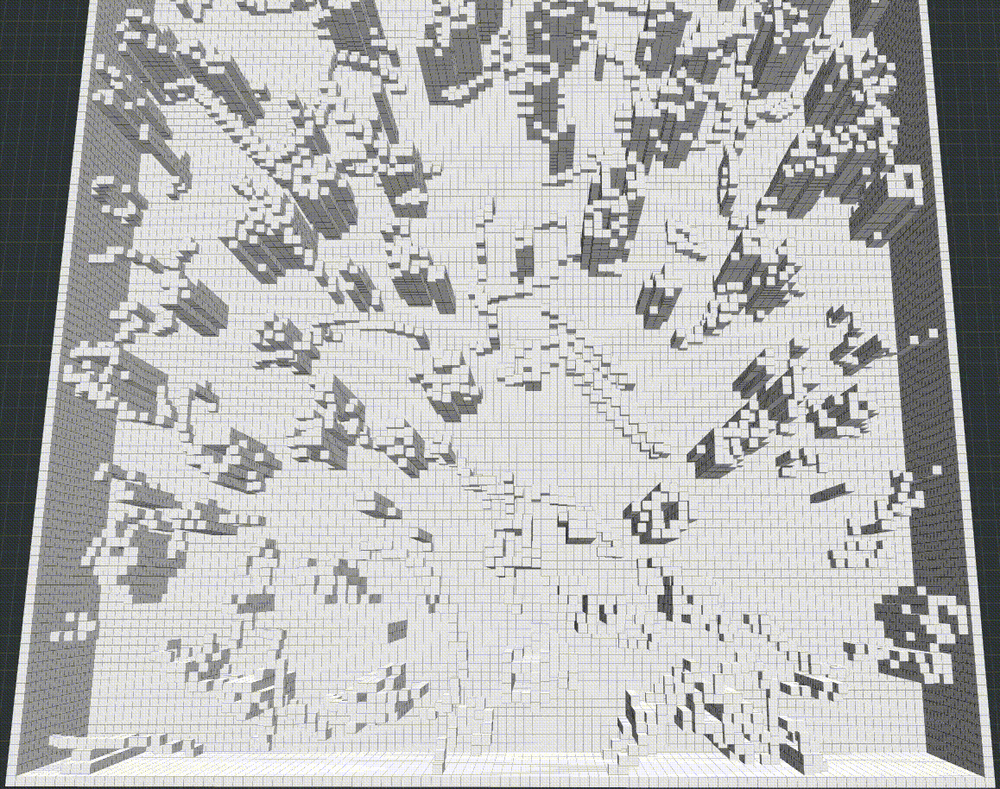
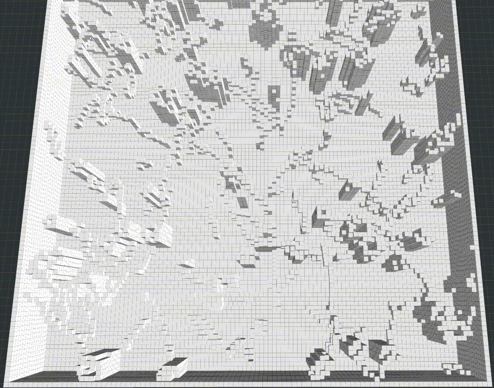

# Bidirectional RRTs
Bidirectional RRT / RRT* for path planning in 3D space. \
The implementation is on the basis of [this repo](https://github.com/ZJU-FAST-Lab/sampling-based-path-finding).
## How to Run
First _catkin_make_. Then open two seperate terminals, _source_, and run:

1. roslaunch path_finder rviz.launch
2. roslaunch path_finder test_planners.launch

In Rviz panel, add a new tool "Goal3DTool", press keyboard "g" and use mouse to set goals.

## BRRT
**RRT_Connect**:  \
 _Kuffner, James J., and Steven M. LaValle. "RRT-connect: An efficient approach to single-query path planning." Proceedings 2000 ICRA._

  

## BRRT*
**IB-RRT***: \
_Qureshi, Ahmed Hussain, and Yasar Ayaz. "Intelligent bidirectional rapidly-exploring random trees for optimal motion planning in complex cluttered environments." Robotics and Autonomous Systems 68 (2015): 1-11._

  

**IB-RRT*** **with informed sampling:** \
_Gammell, Jonathan D., Timothy D. Barfoot, and Siddhartha S. Srinivasa. "Informed sampling for asymptotically optimal path planning." IEEE Transactions on Robotics 34.4 (2018): 966-984._

  

